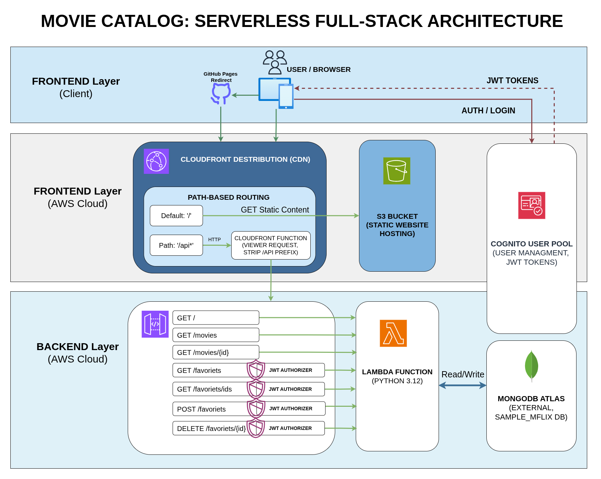
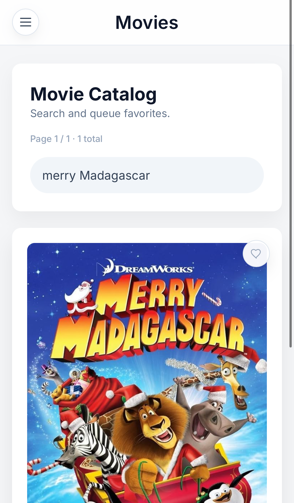
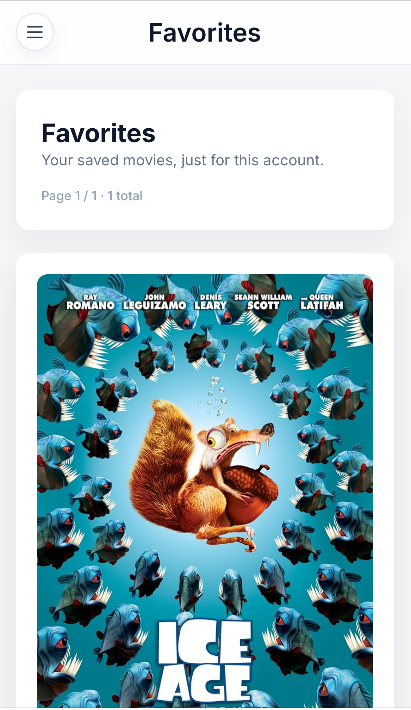
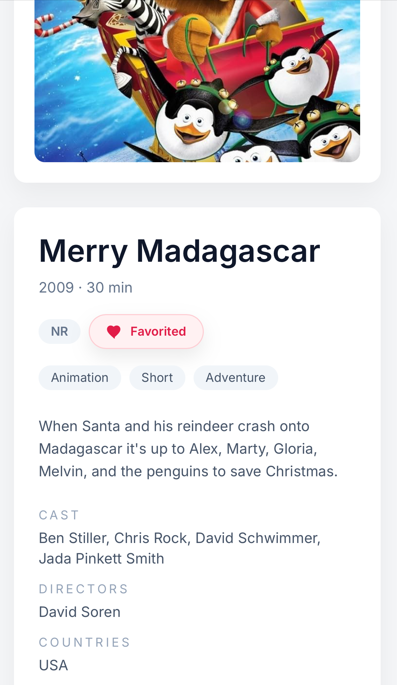
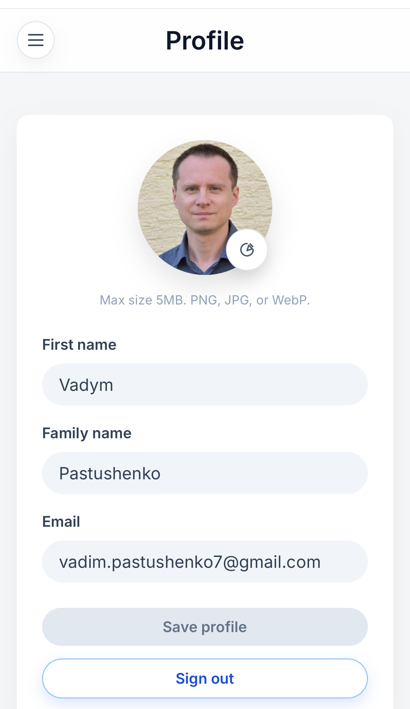

# AWS Fullstack Serverless Movie Catalog Demo

This repo will host a minimal AWS serverless demo with:
- Angular frontend hosted on S3
- API Gateway HTTP API + AWS Lambda (Python)
- Amazon Cognito for authentication
- MongoDB Atlas free tier
- Terraform for AWS infrastructure
- GitHub Actions CI/CD (OIDC, no long-lived keys)

## About
AWS Fullstack Serverless Movie Catalog is a lightweight Angular SPA backed by a
serverless API. The app lets users browse a curated movie catalog, view details,
and manage a favorites list. Sign-in is handled by Amazon Cognito, and protected
actions (like saving favorites) require a valid JWT.



## Screenshots
| Movie Catalog | Favorites Page |
|:---:|:---:|
|  |  |
| *Search and toggle favorites* | *Saved movies* |

| Movie Details | Profile |
|:---:|:---:|
|  |  |
| *Metadata, genres, description* | *Avatar and account fields* |

### Architecture Summary
- Frontend delivery: S3 static website with CloudFront acceleration. All non-API
  routes are served by the S3 origin.
- API layer: CloudFront routes `/api*` requests to an HTTP API in API Gateway,
  with a Lambda function that strips the prefix before forwarding.
- Auth & data: Cognito issues JWTs for protected routes. The Lambda function
  uses a MongoDB connection string to fetch movie data. Favorites require a
  valid token.
- Media storage: A dedicated S3 bucket stores user avatar images.

## Structure
- `frontend/` Angular SPA (movie catalog UI)
- `backend/` Python Lambda (API for catalog + favorites)
- `infra/` Terraform configuration
- `.github/workflows/` CI/CD workflows

## Local Backend (AWS SAM)
- `cd backend`
- `sam build --use-container --cached --skip-pull-image`
- `sam local start-api`

Default local API URL is `http://127.0.0.1:3000`.

## Local Frontend
From `frontend/`:
- `npm install`
- `npm run start`

## Frontend Tests
- Unit tests: `npm run test`
- E2E tests (Playwright): `npm run e2e`

## Backend Notes
Layout:
- `backend/src/app.py` Lambda handler
- `backend/requirements.txt` runtime dependencies for SAM local build
- `backend/template.yaml` AWS SAM template for local API emulation
- `backend/env.json` local environment variables for SAM (`MONGODB_URI`, `MONGODB_DB`)
- `backend/build.sh` creates Terraform deployment zip for `infra/lambda.zip`

Example local request:
- `curl "http://127.0.0.1:3000/movies?page=1"`

Keep Lambda runtime aligned across `backend/template.yaml` and `infra/variables.tf`.

## Debugging (SAM + VS Code)
Prereqs:
- `debugpy` in `backend/requirements.txt`
- VS Code `launch.json` path mapping to `backend/`:

```json
{
  "name": "Attach SAM Local",
  "type": "debugpy",
  "request": "attach",
  "connect": { "host": "localhost", "port": 5859 },
  "pathMappings": [
    { "localRoot": "${workspaceFolder}/backend", "remoteRoot": "/var/task" }
  ]
}
```

Start SAM with debug args:
- `sam build --use-container --cached --skip-pull-image`
- `sam local start-api --host 0.0.0.0 --warm-containers LAZY --debug-port 5859 --debug-function BackendFunction --debug-args "-m debugpy --listen 0.0.0.0:5859 --wait-for-client"`

Attach flow:
- Hit an endpoint once (for example `curl "http://127.0.0.1:3000/movies"`).
- SAM prints `Waiting for debugger to attach...`
- Then click `Attach SAM Local` in VS Code.

## Frontend Build + S3 Upload
- `npm run build -- --configuration production`
- `aws s3 sync dist/ s3://YOUR_BUCKET_NAME/ --delete --exclude "assets/config.json"`

## CI/CD prerequisites
- GitHub repo secrets:
  - `AWS_OIDC_ROLE_ARN`: IAM role ARN for GitHub OIDC
  - `AWS_REGION`: AWS region (e.g. `us-east-1`)
